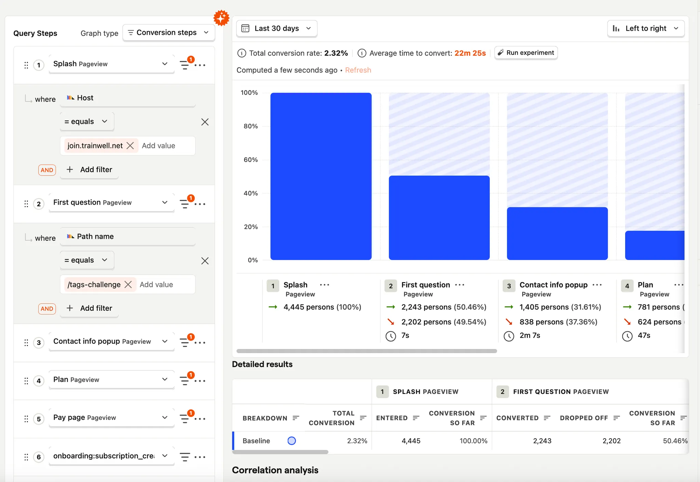

# Trainwell Software Engineer Take Home Project (Data, Growth)

## Objective

To simulate the kind of work you’ll be doing at Trainwell as a software engineer, you will be building a simple version of a funnel performance visualization tool, similar to PostHog or Mixpanel. This tool will allow us easily construct visualizations of web funnels and understand which steps cause drop off. 

## Requirements

1. A React + Typescript Web Application (you can use whatever frontend and project frameworks you want) that recreates basic Mixpanel/Posthog funnel visualization functionality that allows the user to:
    1. Configure a date range to query data from (start date + end date)
    2. Configure an arbitrary number of funnel steps that specify either a path or a hostname (ie hostname=”[www.trainwell.net](http://www.trainwell.net)” , path=“/test-landing-page” 
    3. Visualize the performance of those funnel steps in terms of absolute users per step and % of users that make it from one step to the next. To be clear, the absolute number of users that reach a step may be different than the absolute number of events that match the path/hostname of a given step - in order to reach step 2, a user must have reached step 1 first. 
    4. If you are unfamiliar with PostHog or Mixpanel, we’ve included an example of PostHog’s UI below to show how they lay out this functionality. This is meant to serve as a high-level example, your UI does **not** need to this complex or pretty, we are **not** evaluating you on your UI/UX design. 
        
        
        

1. A basic backend (can be part of the same project/codebase as the frontend) that connects to the MongoDB that holds all of the analytics events and enables your frontend to make specific data queries. 

## Technical Specifications

- You can get read only access to the MongoDB database that holds the sample analytics events via the following connection string URI: `...`
- If you are not familiar with MongoDB, we recommend installing MongoDB compass to use a GUI to help you explore the data and test queries locally. To integrate mongodb into your backend, we recommend using the official `mongodb` library installed via `npm install mongodb` and used as shown in the example code below:

```jsx
const uri = '...';
const client = new MongoClient(uri);
try {
  const database = client.db('trainwell_takehome');
  const events = database.collection('events');
  
  // Query a single even for a given user
  const event = await events.findOne({user_id: "e61b001b-50bc-4143-a17f-265b2b540343"});
  console.log(event);
} finally {
  await client.close();
}
```

- The analytics events are in the `trainwell_takehome` database inside the `events` collection
- The analytics events follow the structure below:

```jsx
{
	_id: ObjectId, //Unique internal MongoDB ID 
	user_id: string, //Unique ID for a given user / web visitor 
	session_id: string, //Unique ID for a given session 
	device_id: string | null, //Unique ID for a given hardware device 
	platform: string
	type: "page_view", //Only event type relevant to this project
	content: {
		path: string,
		hostname: string,
	}
}
```

- For the sake of this project, you should only query events of platform “web” and type “page_view”

## Deliverables

- A link to a GitHub repo and README instructions on how install dependencies and run the application locally.

## Evaluation

- You will be evaluated on the structure, cleanliness, and performance of your code.
- You will be evaluated on achieving the requirements listed above.
- You will **NOT** be evaluated on the UI/UX design of your project.